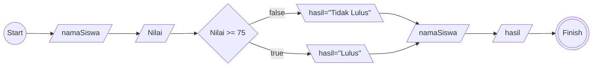

Buatlah program algoritma yang diawali dengan descriptif , flowchart dan pseudo-code !

# Algoritma

## Descriptif

Membuat algoritma menentukan siswa yang lulus dan tidak lulus

1. Mulai
2. Masukan nama siswa
3. Masukan nilai siswa
4. periksa nilai siswa
5. jika nilai lebih besar dari 75 maka siswa lulus
6. jika tidak maka tidak lulus
7. tampilkan hasil nilai dan nama siswanya
8. selesai

## Flowchart



## Pseudo-code

```pseudo

MULAI

DECLARE namaSiswa : STRING
DECLARE nilai : INTEGER
DECLARE hasil : STRING

INPUT namaSiswa
INPUT nilai

IF NILAI >= 75 THEN
    hasil <- "Lulus"
ELSE
    hasil <- "Tidak Lulus"
ENDIF

OUTPUT "Nama Siswa =" , namaSiswa
OUTPUT "Hasilnya adalah =" , hasil

SELESAI


```
