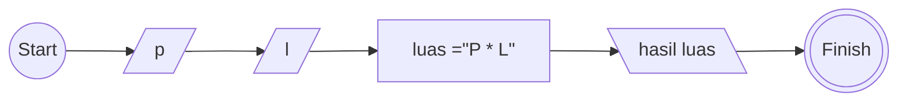

Buatlah program algoritma yang diawali dengan descriptif , flowchart dan pseudo-code !

# Algoritma

## Descriptif

Membuat algoritma meghitung luas persegi panjag

1. Mulai
2. Siapkan persegi panjang yang ingin di hitung luas nya
3. masukan nilai lebar nya
4. lalu hitung luas persegi panjang
5. tampilkan hasil luas
6. selesai

## Flowchart



## Pseudo-code

```pseudo
MULAI

DECLARE p : INTEGER
DECLARE l : INTEGER
DECLARE luas : INTEGER

INPUT p
INPUT l

luas <- p * l

OUTPUT "Luas Persegi panjang =" , luas

SELESAI
```
