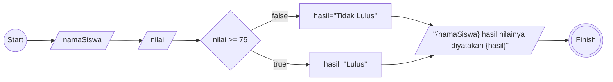

Buatlah program algoritma yang diawali dengan descriptif , flowchart dan pseudo-code !

# Algoritma

## Descriptif

Membuat algoritma menentukan siswa yang lulus dan tidak lulus

1. Mulai
2. Masukan nama siswa
3. Masukan nilai siswa
4. jika nilai lebih besar dari sama dengan 75 maka nilai hasil adalah lulus
5. jika tidak maka tidak lulus
6. outputnya adalah namaSiswa dan hasil nilainya dinyatakan berdasarkan nilai dari hasil
7. selesai

## Flowchart



## Pseudo-code

```pseudo


DECLARE namaSiswa : STRING
DECLARE nilai : INTEGER
DECLARE hasil : STRING

INPUT namaSiswa
INPUT nilai

IF NILAI >= 75 THEN
    hasil <- "Lulus"
ELSE
    hasil <- "Tidak Lulus"
ENDIF

OUTPUT namaSiswa, "hasil nilainya dinyatkan", hasil


```
