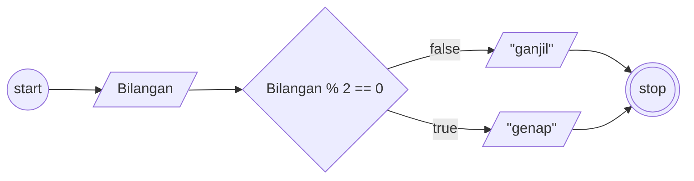

# Algoritma

## Bilangan ganjil atau genap

Membuat algoritma menentukan bilangan ganjil atau genap

1. Mulai
2. Siapkan bilangan ganjil atau genap
3. bilangan yang di modulus 2 dan hasilnya adalah 0 maka di sebut bilangan genap
4. Kalau tidak maka bilangan ganjil
5. Selesai

## Flowchart

Membuat flowchart untuk program menentukan bilangan ganjil atau genap



## Pseudo-code

```pseudo

DECLARE Bilangan: INTEGER
INPUT Bilangan

IF Bilangan % 2 == 0 THEN
    OUTPUT "GENAP"
ELSE
    OUTPUT "GANJIL"
ENDIF

```
