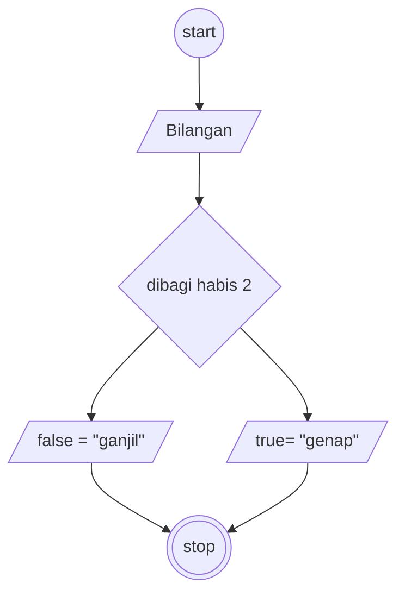

# Algoritma

## Bilangan ganjil atau genap

Membuat algoritma menentukan bilangan ganjil atau genap

1. Mulai
2. Siapkan bilangan ganjil atau genap
3. bilangan di modulus 2 dan hasilnya adalah 0 maka di sebut bilangan genap
4. Kalau tidak menghasil kan nilai 0 maka di sebut bilangan ganjil
5. Selesai

## Flowchart

Membuat flowchart untuk program menentukan bilangan ganjil atau genap

