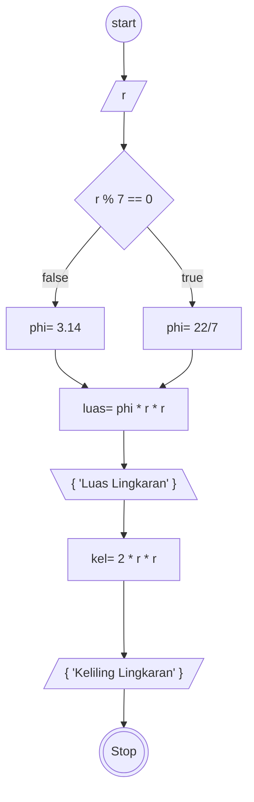

# Algoritma

## Luas dan Keliling

Membuat algoritma meghitung luas dan keliling lingkaran

1. Mulai
2. Persiapkan Lingkaran yang mau di hitung luas dan keliling nya
3. masukkan nilai jari jari nya
4. Tentukan nilai phi nya 22,7 atau 3.14
5. hitung luas dan keliling lingkaran
6. phi kali jari-jari kali jari-jari
7. Maka akan meghasilkan luas lingkaran
8. 2 kali phi kali jari-jari
9. Maka akan menghasilkan Keliling lingkaran
10. Selesai

## Flowchart

Membuat flowchart untuk program menghitung luas dan keliling lingkaran



## Pseudo-code

```pseudo

DECLARE r = INTEGER
DECLARE phi = REAL
DECLARE luas = REAL
DECLARE kel = REAL
Input r

IF r Modulus 7 == 0 THEN
    phi <- 22/7
ELSE
    phi <- 3.14
ENDIF

luas = phi * r * r
keliling = 2 * phi * r

OUTPUT "LUAS LINGKARAN =", luas
OUTPUT "Keliling Lingkaran =", kel

```
