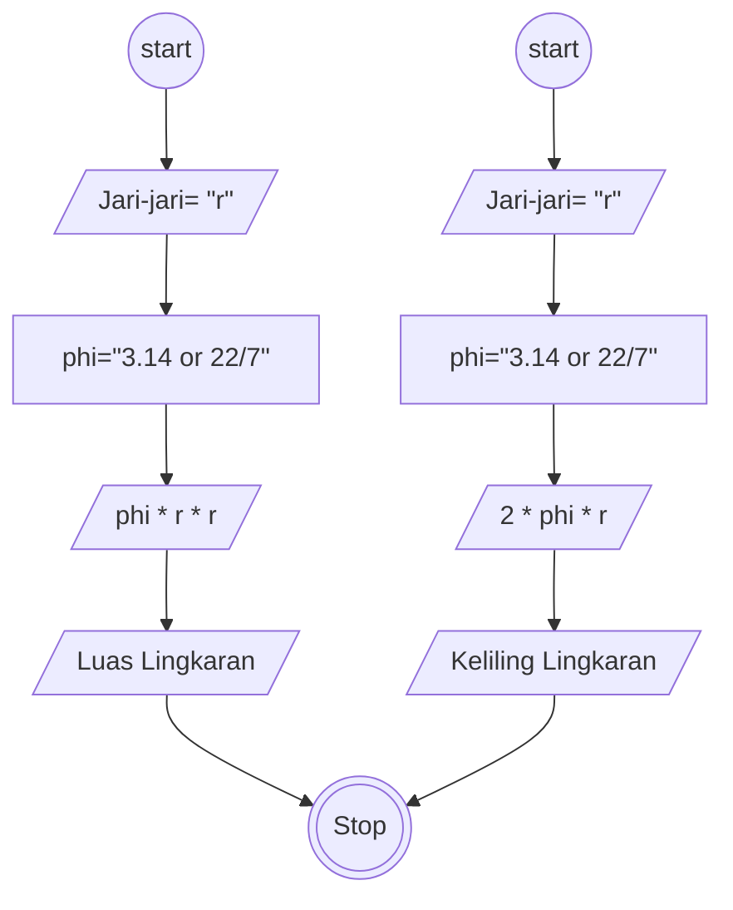

# Algoritma

## Luas dan Keliling

Membuat algoritma meghitung luas dan keliling lingkaran

1. Mulai
2. Persiapkan Lingkaran yang mau di hitung luas dan keliling nya
3. masukkan nilai jari jari nya
4. Tentukan nilai phi nya 22,7 atau 3.14
5. pilih hitung dan luas
6. phi kali jari-jari kali jari-jari
7. Maka akan meghasilkan luas lingkaran
8. 2 kali phi kali jari-jari
9. Maka akan menghasilkan Keliling lingkaran
10. Selesai

## Flowchart

Membuat flowchart untuk program menghitung luas dan keliling lingkaran

